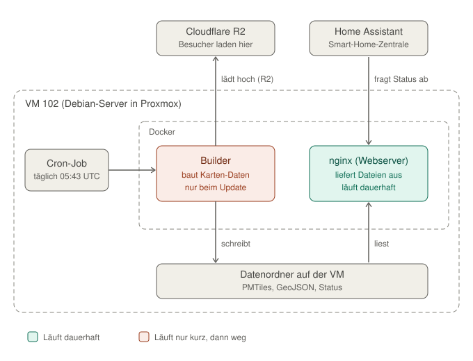
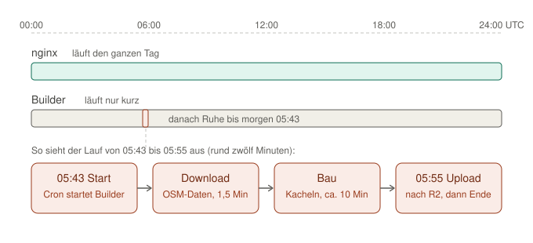

# VM 102 einfach erklärt

Eine Einführung für alle, die Docker noch nicht kennen: Was läuft auf der VM, wann startet was, und was passiert bei einem Neustart?

*Stand: 03.10.2026. Der Zustand der VM wurde an diesem Tag live per SSH geprüft, die Zeiten stammen aus dem Update-Log vom selben Morgen. Für Details und Betriebsabläufe siehe [DOKUMENTATION.md](DOKUMENTATION.md) und [OPERATIONS_INTERNAL.md](OPERATIONS_INTERNAL.md).*

---

## Inhalt

1. [Kurzfassung](#1-kurzfassung)
2. [Das große Bild: Wer liefert die Karte aus?](#2-das-große-bild-wer-liefert-die-karte-aus)
3. [Docker in fünf Minuten](#3-docker-in-fünf-minuten)
4. [Die Bausteine auf der VM](#4-die-bausteine-auf-der-vm)
5. [Ein Tag im Leben der VM](#5-ein-tag-im-leben-der-vm)
6. [Der Update-Lauf Schritt für Schritt](#6-der-update-lauf-schritt-für-schritt)
7. [Was passiert, wenn etwas schiefgeht?](#7-was-passiert-wenn-etwas-schiefgeht)
8. [Selbst nachschauen](#8-selbst-nachschauen)
9. [Glossar](#9-glossar)

---

## 1. Kurzfassung

- **Die VM 102 ist die Datenfabrik, nicht die Auslieferung.** Einmal am Tag baut sie aus OpenStreetMap-Daten die Kartenkacheln für Deutschland, Österreich, die Schweiz, Luxemburg und Liechtenstein und lädt sie zu Cloudflare R2 hoch. Besucher der Karte laden ihre Daten von dort, nie von der VM.
- **Es gibt zwei Docker-Container.** Der **Webserver** (nginx) läuft dauerhaft, braucht aber fast nichts: etwa 10 MB Arbeitsspeicher und praktisch keine Rechenzeit. Der **Builder** läuft nur beim täglichen Update, rund zwölf Minuten, und verschwindet danach.
- **Der Wecker ist ein Cron-Job.** Er startet jeden Tag um 05:43 UTC (07:43 MESZ) das Skript `update.sh`. Dieses startet den Builder, prüft das Ergebnis und lädt es hoch.
- **Neustarts sind harmlos.** Fällt die VM aus, merken Besucher nichts. Der einzige Schaden wäre ein ausgefallenes Update, und das holt der nächste Tag nach.



---

## 2. Das große Bild: Wer liefert die Karte aus?

Die Karte „OpenFireMap" ist eine Webseite. Wenn jemand sie öffnet, braucht sein Browser Daten: Wo stehen Hydranten, Feuerwehrhäuser, Defibrillatoren? Diese Daten liegen in einer großen Datei (`openfiremap.pmtiles`, aktuell rund 182 MiB). Der Browser lädt davon nur die Stücke, die für den sichtbaren Kartenausschnitt nötig sind. Das nennt sich HTTP-Range-Request und ist der Grund, warum die Karte schnell ist.

Diese Datei liegt bei **Cloudflare R2**, einem Online-Speicher, und wird über `pipeline.openfiremap.org` ausgeliefert. Die VM ist daran nur auf einer Seite beteiligt: Sie **erzeugt** die Datei und **stellt sie bereit**, damit R2 sie abholen kann (genauer: Die VM schiebt sie aktiv hoch).

| Frage | Antwort |
|---|---|
| Wer liefert Kacheln an Besucher? | Cloudflare R2, nicht die VM |
| Wer erzeugt die Kacheln? | Die VM (Builder-Container) |
| Was passiert, wenn die VM ausfällt? | Besucher merken nichts, nur der Datenstand wird nicht aktualisiert |
| Wozu dient der Webserver auf der VM? | Lokale Tests, Backup im Heimnetz, Statusseite für Home Assistant |

> Früher lief die Auslieferung über einen Cloudflare-Tunnel zur VM. Der wurde am 29.09.2026 abgeschaltet und am 30.09.2026 aus der Konfiguration entfernt. Seitdem hängt die öffentliche Adresse direkt an R2.

---

## 3. Docker in fünf Minuten

Wer Docker nicht kennt, braucht nur fünf Begriffe. Eine Küche als Bild:

| Begriff | Was es ist | Küchen-Bild |
|---|---|---|
| **Image** | Fertig gepackte Vorlage mit Programm und allem, was es braucht | Das Rezept samt aller Zutaten im Karton |
| **Container** | Ein laufendes Exemplar eines Images, abgeschottet vom Rest der VM | Ein Koch an seinem eigenen Arbeitsplatz, der das Rezept gerade kocht |
| **Volume** | Ordner der VM, der in den Container „eingeblendet" wird | Ein Durchreiche-Fenster zur Vorratskammer: Der Koch kann dort etwas hinlegen, und es bleibt, auch wenn er nach Hause geht |
| **Port** | Eine Tür, durch die man von außen mit dem Container sprechen kann | Die Essensausgabe |
| **Compose** | Eine Textdatei (`docker-compose.yml`), die beschreibt, welche Container es gibt und wie sie zusammenhängen | Der Dienstplan der Küche |

Zwei Gedanken sind für alles Weitere wichtig:

1. **Ein Container ist kein eigener Computer.** Er teilt sich die VM mit anderen Containern, ist aber so abgeschottet, dass er sie nicht stört. Er braucht nur so viel Arbeitsspeicher, wie sein Programm gerade nutzt.
2. **Ein Container lebt nur so lange, wie sein Programm läuft.** Ein Webserver läuft ewig, also läuft sein Container ewig. Ein Build-Programm ist nach zwölf Minuten fertig, also endet auch sein Container nach zwölf Minuten. Das ist kein Fehler, sondern der Normalfall.

---

## 4. Die Bausteine auf der VM

### 4.1 Der Webserver `openfiremap-web`

- **Technik:** `nginx:alpine`, ein sehr kleiner, bewährter Webserver.
- **Lebensdauer:** Dauerhaft. Die Einstellung `restart: unless-stopped` sorgt dafür, dass er nach einem Neustart der VM von selbst wieder hochkommt. Ein Healthcheck fragt alle 30 Sekunden, ob er noch antwortet.
- **Verbrauch:** Bei der Prüfung am 03.10.2026 etwa 10 MiB Arbeitsspeicher und 0 % CPU.
- **Aufgaben:**
  1. Die fertigen Dateien aus dem Ordner `publish/` ausliefern (mit Range-Unterstützung und CORS, damit auch ein Browser auf einer anderen Domain zugreifen darf). Das dient lokalen Tests und als Backup im Heimnetz.
  2. Unter `/internal/` zwei Statusdateien anzeigen (`system_stats.json`, `sync_status.json`). Das erreicht nur, wer im lokalen Netz ist. Home Assistant liest sie, um den Zustand der Pipeline zu überwachen.
- **Erreichbar über:** Port 8080 im Heimnetz.

### 4.2 Der Builder `openfiremap-builder`

- **Technik:** Ein Python-Programm (`build_features.py`) mit den Werkzeugen `osmium` (filtert OSM-Daten) und `tippecanoe` (baut daraus Vektorkacheln).
- **Lebensdauer:** Nur während des täglichen Updates, rund zwölf Minuten. Er wird nicht dauerhaft betrieben, sondern vom Update-Skript gestartet und ist danach wieder weg.
- **Aufgaben:**
  1. Die aktuellen OpenStreetMap-Auszüge für Deutschland, Österreich, die Schweiz, Luxemburg und Liechtenstein von Geofabrik herunterladen (nur, wenn sie sich geändert haben).
  2. Daraus feuerwehrrelevante Objekte herausfiltern: Hydranten, Feuerwachen, Löschwasserstellen, Defibrillatoren.
  3. Die Objekte zu einer PMTiles-Datei verpacken und eine `metadata.json` mit Version und Statistik erzeugen.
- **Wichtig:** Er schreibt seine Ergebnisse in den gemeinsamen Datenordner (siehe 4.4). Dort liegen sie auch dann noch, wenn der Container längst beendet ist.

### 4.3 Der Wecker: der Cron-Job

Cron ist der eingebaute Zeitplaner von Linux. Auf der VM steht genau ein Eintrag:

```
43 5 * * *   /srv/docker/projects/openfiremap-pipeline/update.sh
```

Gelesen: „Jeden Tag um 05:43 Uhr führe `update.sh` aus." Die VM läuft auf UTC, das sind 07:43 Uhr im Sommer (MESZ) und 06:43 Uhr im Winter (MEZ).

Warum so spät und mit einer krummen Minute? Geofabrik, die Quelle der OSM-Daten, veröffentlicht nachts neue Tagesauszüge, ungefähr zwischen 01:00 und 04:15 UTC. Ein früherer Start (03:30 UTC) führte am 30.09.2026 zu einem Fehlschlag, weil die Daten noch nicht fertig waren. Die „krumme" Minute 43 vermeidet Lastspitzen auf dem Download-Server, die zur vollen Stunde entstehen.

### 4.4 Der gemeinsame Datenordner

Alles Dauerhafte liegt im Ordner `/srv/docker/data/openfiremap` auf der VM, nicht in den Containern:

| Unterordner / Datei | Inhalt |
|---|---|
| `raw/` | Heruntergeladene OSM-Auszüge, Fingerprints (Merkzettel zum Vergleichen), Statusdateien |
| `publish/` | Das fertige Ergebnis: PMTiles, GeoJSON, `metadata.json` |
| `update.log` | Das Protokoll aller Update-Läufe |

Beide Container sehen diesen Ordner über Volumes: Der Builder schreibt hinein, der Webserver liest nur (daher in der Grafik „schreibt" und „liest"). Weil die Daten außerhalb der Container liegen, überleben sie jeden Neustart und jede Container-Neuerstellung.

---

## 5. Ein Tag im Leben der VM



**23 Stunden und 48 Minuten Ruhe, zwölf Minuten Arbeit.** Der Webserver läuft durch, tut aber fast nichts, außer gelegentlich eine Statusabfrage zu beantworten. Der Builder existiert nur zwischen 05:43 und etwa 05:55 UTC.

Die Zeiten stammen aus dem Lauf vom 03.10.2026:

| Uhrzeit (UTC) | Was passiert |
|---|---|
| 05:43 | Cron startet `update.sh`, das wiederum den Builder startet |
| ca. 05:43 – 05:45 | Download der OSM-Auszüge (rund 98 Sekunden) |
| ca. 05:45 – 05:54 | Bau der Kacheln (rund 597 Sekunden, knapp zehn Minuten) |
| 05:54 | Build fertig, Builder-Container beendet sich |
| 05:54 – 05:55 | Upload nach Cloudflare R2 und Prüfung, dass der öffentliche Stand stimmt |
| ab 05:55 | Ruhe bis zum nächsten Tag |

An manchen Tagen ist noch weniger los: Haben sich die OSM-Daten nicht geändert, startet der Builder zwar kurz, merkt das aber sofort, baut nichts neu und lädt nichts hoch (siehe 6.3). Der Lauf ist dann deutlich kürzer (die genaue Dauer hängt vom Herunterladen der Prüfdaten ab und wurde hier nicht gemessen).

> **Hinweis zu `docker ps -a`:** Das Update-Skript startet den Builder mit `docker compose run --rm builder`. Das Wort `--rm` bedeutet: Der Container wird nach dem Lauf **automatisch gelöscht**. Wer danach `docker ps -a` ausführt, sieht den Builder deshalb normalerweise nicht. Ein Eintrag wie `openfiremap-builder … Exited (0) 2 days ago` ist vermutlich ein Überbleibsel eines früheren, manuellen Starts (ohne `--rm`) und hat mit dem Cron-Lauf nichts zu tun. Die `0` in `Exited (0)` heißt „fehlerfrei beendet".

---

## 6. Der Update-Lauf Schritt für Schritt

Das Skript `update.sh` ist der Dirigent. Es macht nicht selbst die Arbeit, sondern ruft die Beteiligten in der richtigen Reihenfolge auf und prüft das Ergebnis.

### 6.1 Ablauf in Kurzform

1. **Doppelstart verhindern.** Das Skript legt eine Sperre an (`update.lock`). Läuft schon ein Update, etwa weil jemand es von Hand gestartet hat, bricht das zweite sofort ab (Exit-Code 3). So können sich zwei Läufe nicht gegenseitig die Dateien wegnehmen.
2. **Builder starten.** Das ist der Hauptteil: herunterladen, filtern, Kacheln bauen. Das Protokoll geht nach `update.log`.
3. **Ergebnis auswerten.** Der Exit-Code des Builders sagt, ob gebaut wurde, ob es nichts Neues gab (Code 10) oder ob eine Quelle veraltet ist (Code 11). Daraus entscheidet das Skript, ob etwas hochgeladen werden muss.
4. **Upload nach R2** (nur wenn nötig, siehe 6.2).
5. **Prüfen.** Das Skript fragt die öffentliche Adresse ab und vergleicht Zeitstempel und Dateigröße mit dem lokalen Stand. Passt das nicht, wird bis zu dreimal im Abstand von 20 Sekunden nachgeprüft.
6. **Status schreiben.** Das Ergebnis landet in `sync_status.json`. Von dort liest es Home Assistant.

### 6.2 Die Upload-Reihenfolge ist Absicht

Der Upload läuft in drei Schritten, und die Reihenfolge ist das Sicherheitsnetz:

1. Zuerst die PMTiles-Datei (die große).
2. Dann die GeoJSON-Dateien.
3. **Zuletzt** die `metadata.json`.

Die `metadata.json` ist der Schalter, der den neuen Stand „scharf" macht. Die Karte liest aus ihr, welche Version aktuell ist. Bricht ein Upload mittendrin ab, liegen vielleicht neue Kacheln im Speicher, aber die `metadata.json` zeigt noch auf den alten Stand. Besucher sehen dann weiter den kompletten, alten Stand, nie ein halbes Gemisch. Schlägt ein früherer Schritt fehl, wird die `metadata.json` gar nicht erst hochgeladen.

### 6.3 Vier mögliche Ergebnisse

Das Feld `result` in `sync_status.json` zeigt, wie der Lauf ausging:

| Ergebnis | Bedeutung | Aufwand |
|---|---|---|
| `built` | Es gab neue Daten, es wurde gebaut und hochgeladen | voll (hier ca. zwölf Minuten) |
| `skipped_no_changes` | Nichts hat sich geändert, R2 hat bereits den aktuellen Stand | kein Bau, kein Upload |
| `upload_only` | Nichts Neues zu bauen, aber der lokale Stand ist noch nicht auf R2 (z. B. nach einem früheren Upload-Fehler) | nur Upload |
| `skipped_stale_source` | Nichts gebaut, aber eine Datenquelle war nicht erreichbar oder veraltet; Warnung wird vermerkt | kein Upload |

**Warum nicht jeden Tag neu bauen?** Wenn die Daten sich nicht geändert haben, wäre ein Neubau Verschwendung. Außerdem würde jeder Upload die zwischengespeicherten Kacheln bei Cloudflare ungültig machen, und die Karte würde kurz langsamer. Das Überspringen bewirkt, dass die Kacheln dort dauerhaft aus dem Zwischenspeicher kommen.

Erkannt wird „unverändert" über **Fingerprints**: Pro Land wird Größe und Änderungsdatum der Datei festgehalten, außerdem ein Hash des Builder-Codes. Ändert sich keines von beiden, gibt es nichts zu tun.

---

## 7. Was passiert, wenn etwas schiefgeht?

### 7.1 Die VM wird neu gestartet (z. B. wegen eines Proxmox-Updates)

Das ist der Fall, den man am häufigsten hat. Die Folgen im Überblick:

| Was | Folge |
|---|---|
| **Besucher der Karte** | Nichts. Sie sind nicht von der VM abhängig. |
| **Webserver (nginx)** | Ein paar Sekunden bis Minuten weg, startet danach von selbst wieder. |
| **Home-Assistant-Sensoren** | Zeigen kurz „nicht verfügbar", bis nginx wieder antwortet. Es gehen keine Daten verloren. |
| **Datenordner** | Unberührt, die Dateien liegen auf der Platte der VM. |
| **Update-Lauf, wenn er nicht gerade läuft** | Nichts passiert. |
| **Update-Lauf, wenn die VM zur Cron-Zeit aus ist** | Dieser Tag fällt aus. Cron holt verpasste Läufe nicht nach. Der nächste Tag baut und lädt dann hoch. |
| **Update-Lauf, wenn er mittendrin unterbrochen wird** | Der Lauf bricht ab. Der Stand auf R2 bleibt unverändert und vollständig (Reihenfolge, siehe 6.2). Der Fingerprint des veröffentlichten Stands wird erst nach erfolgreicher Prüfung aktualisiert, sodass der nächste Lauf sauber neu baut. |

**Faustregel:** Die VM kann jederzeit neu gestartet werden, **außer ungefähr zwischen 05:40 und 06:00 UTC** (07:40 bis 08:00 Uhr MESZ). Wer dort neu startet, riskiert im schlimmsten Fall ein ausgefallenes Tages-Update.

### 7.2 Die Datenquelle (Geofabrik) hakt

Ist Geofabrik nicht erreichbar oder liefert Fehler, versucht der Builder mehrere Wege: wiederholte Downloads, datierte Tagesauszüge (heute, gestern, vorgestern) und notfalls die zuletzt vorhandene lokale Datei (höchstens 72 Stunden alt). Das Ergebnis wird transparent vermerkt. Home Assistant meldet sich, wenn die Daten älter als 48 Stunden werden.

### 7.3 Upload oder Prüfung schlägt fehl

- Schlägt ein Upload-Schritt fehl, bleibt der alte Stand auf R2 aktiv. `sync_status.json` meldet `upload_ok: false`, und das Skript endet mit Exit-Code 1.
- Passt der öffentliche Stand nach drei Prüfversuchen nicht zum lokalen, endet das Skript mit Exit-Code 2 und `in_sync: false`.

In beiden Fällen läuft die Karte für Besucher weiter, nur eben mit dem alten Datenstand.

### 7.4 Und wenn die komplette Pipeline ausfällt?

Das Frontend ist darauf vorbereitet: Erkennt es, dass die Pipeline-Daten fehlen oder nicht zum Kartenausschnitt passen, fragt es stattdessen direkt die öffentlichen OpenStreetMap-Abfragedienste (Overpass) an. Die Karte wird dann etwas langsamer, bleibt aber nutzbar.

---

## 8. Selbst nachschauen

Alle folgenden Befehle verändern nichts, sie lesen nur. Sie werden auf der VM ausgeführt (`ssh frank@docker-lab-KW3`, per VPN oder im Heimnetz).

**Welche Container gibt es, und läuft der Webserver?**

```bash
docker ps -a --format "table {{.Names}}\t{{.Image}}\t{{.Status}}"
```

**Wie viel verbrauchen sie gerade?**

```bash
docker stats --no-stream
```

**Wann läuft das Update?**

```bash
crontab -l
```

**Wie ist das letzte Update gelaufen?**

```bash
tail -n 30 /srv/docker/data/openfiremap/update.log
cat /srv/docker/data/openfiremap/raw/sync_status.json
```

Wichtige Felder in `sync_status.json`: `result` (siehe 6.3), `in_sync` (soll `true` sein), `upload_ok` (soll `true` sein) und `last_error` (soll `null` sein).

**Wie lange läuft die VM schon?**

```bash
uptime
```

---

## 9. Glossar

| Begriff | Bedeutung |
|---|---|
| **Builder** | Der Container, der aus OSM-Daten die Kartenkacheln baut |
| **Compose** | Docker-Werkzeug, das mehrere Container über eine Textdatei verwaltet |
| **Container** | Abgeschottetes, laufendes Programm-Paket |
| **Cron** | Zeitplaner von Linux; führt Befehle zu festgelegten Zeiten aus |
| **Exit-Code** | Zahl, mit der ein Programm sein Ende meldet. `0` heißt „alles gut", andere Zahlen haben eine Bedeutung (hier z. B. `10` = nichts Neues) |
| **Fingerprint** | Merkzettel (Größe, Datum, Hash), mit dem erkannt wird, ob sich etwas geändert hat |
| **Geofabrik** | Dienst, der OpenStreetMap-Daten als Länderauszüge bereitstellt |
| **GeoJSON** | Textformat für Geodaten |
| **Healthcheck** | Regelmäßige Selbstprüfung eines Containers („antwortest du noch?") |
| **Image** | Fertig gepackte Vorlage, aus der Container entstehen |
| **nginx** | Kleiner, schneller Webserver |
| **OSM / OpenStreetMap** | Freie, gemeinschaftlich gepflegte Weltkarte, Datenquelle von OpenFireMap |
| **PMTiles** | Dateiformat für Vektorkacheln in einer einzigen Datei, aus der man gezielt Stücke abrufen kann |
| **Proxmox** | Virtualisierungsplattform, auf der die VM läuft |
| **R2 (Cloudflare R2)** | Online-Speicher, von dem die öffentliche Karte ihre Daten lädt |
| **Range-Request** | Abruf nur eines Teilstücks einer Datei, statt der ganzen |
| **Volume** | Ordner der VM, der in einen Container eingeblendet wird |
| **VM** | Virtueller Computer, hier Nr. 102 auf dem Proxmox-Server |
